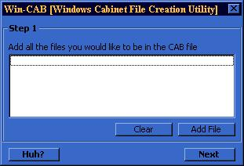



## Create Windows Cabinet Files

### Description

Lets you create A windows cabinet file (.cab) containing any file(s) of YOUR choice. Since a cabinet file is something windows uses. Once you make it, you can give it to anyone and they can open/extract it without special files. PLEASE vote and/or leave feedback/comments on what you think.
 
### More Info
 
Just look at the souce comments. Most of it is pretty simple.

None - I don't think.

             |
---                |---
**Submitted On**   |2000-08-23 02:40:54
**By**             |[The SoTe](https://github.com/Planet-Source-Code/PSCIndex/blob/master/ByAuthor/the-sote.md)
**Level**          |Beginner
**User Rating**    |4.4 (70 globes from 16 users)
**Compatibility**  |VB 5\.0
**Category**       |[Files/ File Controls/ Input/ Output](https://github.com/Planet-Source-Code/PSCIndex/blob/master/ByCategory/files-file-controls-input-output__1-3.md)
**World**          |[Visual Basic](https://github.com/Planet-Source-Code/PSCIndex/blob/master/ByWorld/visual-basic.md)
**Archive File**   |[CODE\_UPLOAD9543922000\.zip](https://github.com/Planet-Source-Code/the-sote-create-windows-cabinet-files__1-11200/archive/master.zip)

